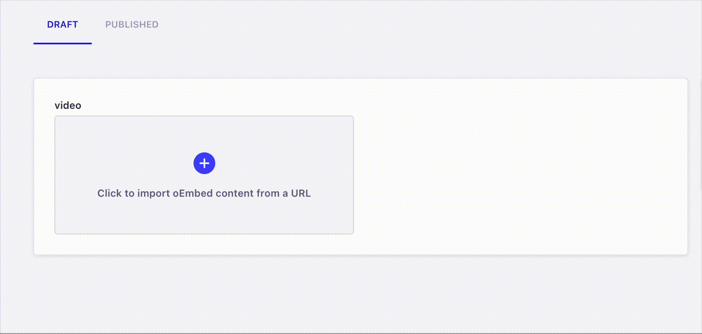

# Strapi plugin oEmbed

Embed content from third party sites (Youtube, Vimeo, Tiktok, Soundcloud, ...) for https://strapi.io v4 (For strapi v3 use v0.4.0)



## How it works

- Add the field in your model
- When you create a new content, paste the URL of the third party site in the modal
- The data is fetched and stored in the content

## Installation

Using npm

```bash
npm install --save strapi-plugin-oembed
npm run build
```

Using yarn

```bash
yarn add strapi-plugin-oembed
yarn build
```

## Setup

Go to your model and add the `oembed` field. For example if you have a content type `Article` it will be in `/api/article/models/article.settings.json` and paste the field in the `attributes` section.

e.g

```json
{
  "kind": "collectionType",
  "collectionName": "articles",
  ...
  "attributes": {
    ...
    "oembed": {
      "type": "customField",
      "customField": "plugin::oembed.oembed"
    }
    ...
  }
}
```

Now you'll have the oembed field when you create a new article.

## Example of the data fetched

If you paste the url `https://www.youtube.com/watch?v=tkiOqSTVGds` in the modal, this data will be stored:

```json
{
  "url": "https://www.youtube.com/watch?v=tkiOqSTVGds",
  "title": "Beautiful New Caledonia",
  "thumbnail": "https://i.ytimg.com/vi/tkiOqSTVGds/hqdefault.jpg",
  "mime": "video/youtube",
  "rawData": {
    "type": "video",
    "thumbnail_url": "https://i.ytimg.com/vi/tkiOqSTVGds/hqdefault.jpg",
    "thumbnail_width": 480,
    "html": "<iframe width=\"480\" height=\"270\" src=\"https://www.youtube.com/embed/tkiOqSTVGds?feature=oembed\" frameborder=\"0\" allow=\"accelerometer; autoplay; clipboard-write; encrypted-media; gyroscope; picture-in-picture\" allowfullscreen></iframe>",
    "version": "1.0",
    "width": 480,
    "author_url": "https://www.youtube.com/user/lilomoino",
    "provider_name": "YouTube",
    "thumbnail_height": 360,
    "height": 270,
    "author_name": "LilO Moino",
    "provider_url": "https://www.youtube.com/",
    "title": "Beautiful New Caledonia"
  }
}
```

**Note:** the data returned from your endpoint will be a string and not a JSON object. You'll just have to parse the data in your front (`JSON.parse(article.oembed)`).

## Supported third party sites

- Youtube
- Vimeo
- Tiktok
- Soundcloud

Feel free to submit a PR with the provider you want, you just have to edit this file: `server/services/oembed.js`.
